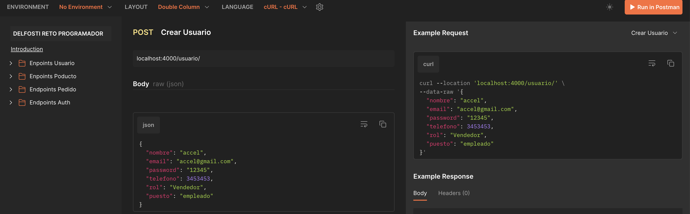
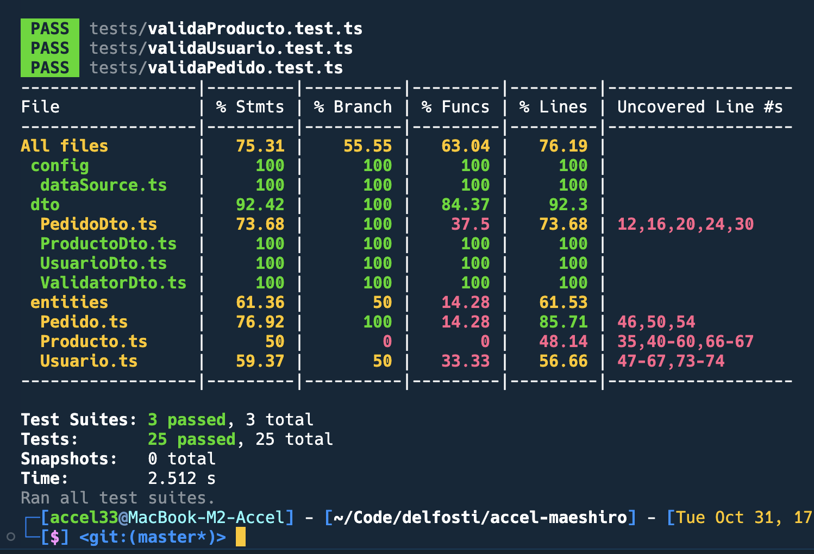

### Reto Delfosti

Se quiere desarrollar un sistema que tiene como actividad principal la venta de productos básicos. Su principal problema es que no realizan un correcto _tracking_ al momento de hacer los pedidos de productos para abastecer su stock.

### Proceso Principal

1. Usuario se loguea al sistema y recibe un token de acceso como respuesta de la solicitud a la ruta /auth. Al mismo tiempo recibe una cookie en la cual se encuentra el token de refresco (Tanto la cookie como el token tienen mismo tiempo de vida, siete días).

2. Usuario se encarga del nuevo pedido.

3. Usuario puede modificar el estado, asignar repartidor y asignar vendedor.

### Proceso Secundario

- Usuario puede crear, actualizar, listar y borrar pedidos.

- Usuario puede crear, actualizar, listar y borrar productos.

- Usuario puede crear, actualizar, listar y borrar usuarios.

### Configuración inicial

Clonar el repositorio para empezar a utilizar la aplicación. Hay que tener instalado [Nodejs](https://nodejs.org/en) de manera global si se quiere probar en local. Una vez completada la instalación ingresar a la carpeta y ejecutar el comando:

```

npm install

```

##### El package.json del proyecto cuenta con los siguientes comandos:

1. Comando para correr la aplicacion de manera local:

```

npm start

```

2. Comando para ejecutar las pruebas unitarias de la aplicación:

```

npm test

```

3. Comando para compilar generar el build de la aplicación en /build en codigo javascript:

```

npm run build

```

##### .env

```

NODE_ENV=${Entorno de desarrollo}

PORT=${Puerto de ejecucion}

ACCESS_KEY=${Tu Llave de Acceso}

SECRET_KEY=${Tu Clave Secreta}

```

### Documentación Postman

https://documenter.getpostman.com/view/3273833/2s9YXbB6rz



---

### Pruebas en desarrollo



---
