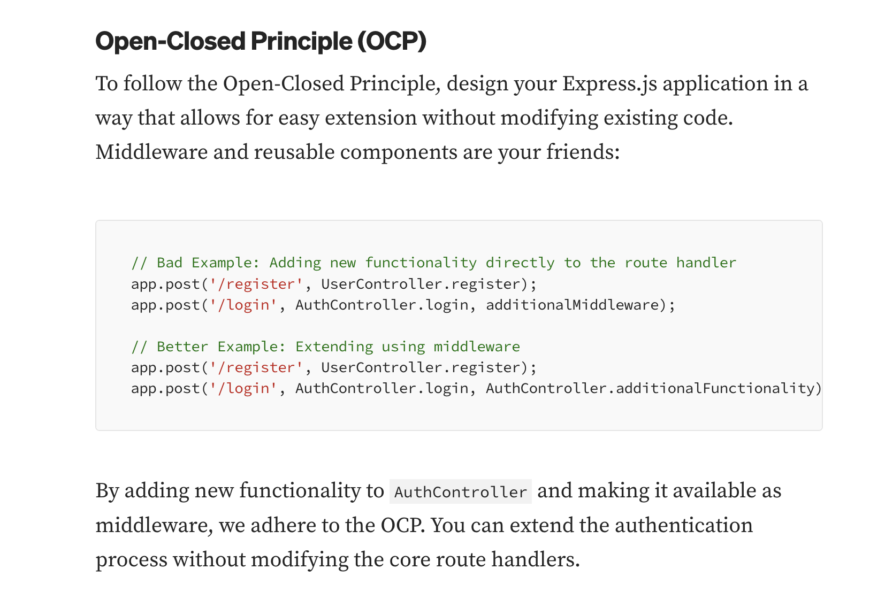

### Reto Delfosti

Se quiere desarrollar un sistema que tiene como actividad principal la venta de productos basicos. Su principal problema es que no realizan un correcto TRACKING al momento de hacer los pedidos de productos para abastecer su stock.

### Diagrama de flujo

1. Usuario se loguea al sistema
2. Usuario encargado atiende el nuevo pedido
3. 

### Pendientes
- [ ] Proyecto requiere Inversion de dependencia

<br>
- [ ] Proyecto requiere Sustitucion de Liskov

<br>
- [ ] Necesito una explicacion para este principio

<br>
- [ ] Utilizar el DTO como Request

<br>
- [ ] Utilizar el DTO como Request

<br>
- [ ] Error con el Enum

<br>

### Valores de Estado y Roles

```
Estado De Pedido {
  POR_ATENDER = 0,
  EN_PROCESO = 1,
  DELIVERY = 2,
  RECIBIDO = 3,
}

Rol De Usuario {
  ENCARGADO = 0,
  VENDEDOR = 1,
  DELIVERY = 2,
  REPARTIDOR = 3,
}
```
